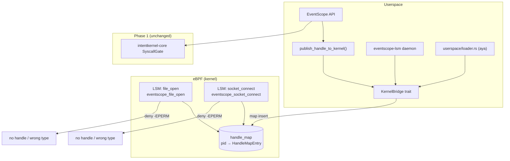

# EventScope eBPF + LSM (Phase 2 PoC)

Moves IntentKernel capability enforcement from userspace interception to **Linux LSM BPF hooks**, aligned with the roadmap item: *"Linux: LSM module + eBPF hooks"*.

Phase 1 (`kernel/eventscope`) intercepts file/network/raw access in userspace. Phase 2 attaches kernel hooks on **`openat` → `file_open`** and **`connect` → `socket_connect`**, reading capability handles from a BPF hash map populated by userspace.

## Architecture



### Policy (mirrored in Rust + BPF C)

| Hook | Syscall path | Required `resource_type` |
|------|----------------|--------------------------|
| `file_open` | `openat(2)` | `1` (FILE) |
| `socket_connect` | `connect(2)` | `2` (NETWORK) |

No valid handle in `handle_map` for the calling PID → **deny**.

### Map entry layout

```c
struct ik_handle_entry {
    u64 handle;          // IntentKernel capability handle
    u32 pid;             // target process
    u32 resource_type;   // 1=file, 2=network, 3=raw
    u8  valid;           // 0 = revoked
};
```

## Directory layout

```
kernel/eventscope-ebpf/
├── bpf/eventscope.bpf.c      # LSM programs + handle_map
├── userspace/loader.rs       # aya loader (feature `bpf`)
├── src/
│   ├── lib.rs                # policy + bridge + loader module
│   ├── policy.rs             # shared policy (used by tests)
│   └── bridge.rs             # KernelBridge / mock map
├── tests/mock_policy_integration.rs
└── README.md
```

Companion daemon: `kernel/eventscope-lsm/` — JSON stdin control plane for map publish/check.

## Build (no root required)

Default workspace build compiles policy and mock bridge **without** aya or BPF toolchain:

```bash
cd /path/to/cautious-octo-dollop
cargo build -p eventscope-ebpf
cargo build -p eventscope-lsm
cargo test -p eventscope-ebpf
cargo test -p eventscope-lsm
```

### Optional: aya loader

```bash
cargo build -p eventscope-ebpf --features bpf --bin eventscope-bpf-loader
```

Requires Linux, `CAP_BPF` (or root), and a compiled BPF object.

## BPF object compile

```bash
./scripts/load-eventscope-bpf.sh build
```

**Requirements:**

| Component | Purpose |
|-----------|---------|
| `clang`, `llvm` | Compile `bpf/eventscope.bpf.c` to `eventscope.bpf.o` |
| `linux-headers-$(uname -r)` | BPF helper definitions |
| `libbpf-dev` | `bpf/bpf_helpers.h` |
| `CONFIG_BPF_LSM=y` | LSM BPF attachment |
| `CAP_BPF` or root | Load programs and write maps |

**WSL2:** stock WSL2 kernels often lack full LSM BPF support. Use mock mode for policy validation:

```bash
./scripts/load-eventscope-bpf.sh mock
```

## Load / attach

```bash
# Probe readiness (object + config hints)
./scripts/load-eventscope-bpf.sh probe

# Build object + attempt attach (needs root)
sudo ./scripts/load-eventscope-bpf.sh load

# Mock daemon only
./scripts/load-eventscope-bpf.sh mock
```

Set custom object path:

```bash
export EVENTSCOPE_BPF_OBJ=/path/to/eventscope.bpf.o
```

## Bridge from EventScope

After registering a token in userspace:

```rust
let handle = es.register_token(&token)?.raw;
es.publish_handle_to_kernel(handle)?;
```

Writes `{ pid, handle, resource_type }` into `handle_map` when the loader is active; otherwise uses the in-memory mock map (integration tests).

## Fallback strategy

| Environment | Behavior |
|-------------|----------|
| CI / `cargo test` | `MockKernelBridge` + `evaluate_hook` integration tests |
| WSL2 dev | Compilable skeleton; `load` may fail → mock daemon |
| Linux + CAP_BPF | `aya` attaches LSM programs; live enforcement |

If `bpf-linker` / cross-compile to `bpfel-unknown-none` is needed for embedding, this PoC loads a **precompiled** `.bpf.o` from `scripts/load-eventscope-bpf.sh build` instead — avoiding broken default builds when the BPF target is unavailable.

## Related crates

- `kernel/eventscope` — Phase 1 userspace intercept + `publish_handle_to_kernel`
- `kernel/eventscope-lsm` — LSM daemon / JSON control plane
- `kernel/intentkernel-core` — capability handles and syscall gate